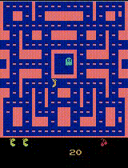
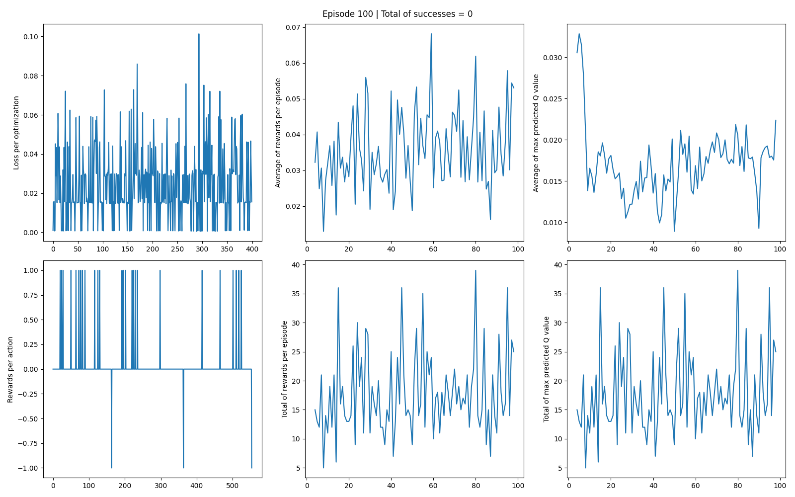
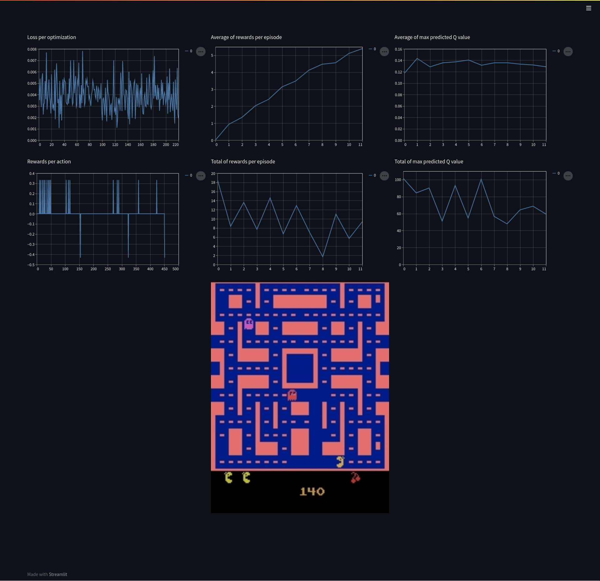

# Deep Q-Network on the Atari Game Ms-Pacman

<p align="center">
  
</p>

## For installation

It is **highly recommended** to install packages in a virtual environment.

### Installation of the Atari environment

```sh
pip install ale-py==0.7
wget http://www.atarimania.com/roms/Roms.rar
unrar e Roms.rar
unzip -qq ROMS.zip
ale-import-roms /content/ROMS/ | grep pacman

pip install -U gym
pip install -U gym[atari]
```

### Installation of dependencies

```sh
python setup.py install
```

**Note :** If you don't follow the setup file, `opencv-python` and `matplotlib` could be incompatible depending on the versions of packages. `opencv-python` is only used to write a video in `eval.py`.

## For usage

### Train the agent

In `deep_Q_network` folder, you can find the file `parameters.py` where parameters are set. After checking them, you can run the training with the following command line

```sh
python main.py
```

### Train and save evolution step by step (a lot of memory)

To save the evolution step by step, simply run:
```sh
python main.py --image
```



### Dynamic display (slow)

This mode is useful when you want to see how the agent reacts and interacts with his environment.

To display the "dashboard", simply run :
```sh
python main.py --dynamic
```




## Structure of the code
```
.
├── deep_Q_network
│   ├── __init__.py
│   ├── decision.py # for decision making
│   ├── memory.py # replay memory
│   ├── model.py # dueling DQN and optimization (see the class for more details)
│   ├── parameters.py # all parameters except how rewards are managed
│   └── preprocessing.py # for preprocessing observations
├── docs
│   └── ...
├── evaluation # only use by `eval.py`
│   ├── __init__.py
│   ├── parser.py
│   ├── path.py # manage path
│   └── utils.py
├── utils
│   ├── __init__.py
│   ├── display.py # to save data and display them with `matplotlib`
│   ├── parser.py
│   ├── start.py # manage starting path
│   └── utils.py
├── results
│   └── training-[...]
│       ├── models # folder with pytorch models
│       │   ├── policy-model-[...].pt
│       │   └── target-model-[...].pt
│       ├── plots # folder for `python main.py --image` command
│       │   └── episode-[...].png
│       ├── recorded-data # folder with pickle files
│       │   └── episode-[...].pkl
│       ├── output_video.avi
│       ├── q_values.png
│       ├── result.png
│       └── rewards.png
├── eval.py # to evaluate the agent
├── main.py # to train the agent
├── README.md
└── setup.py
```
